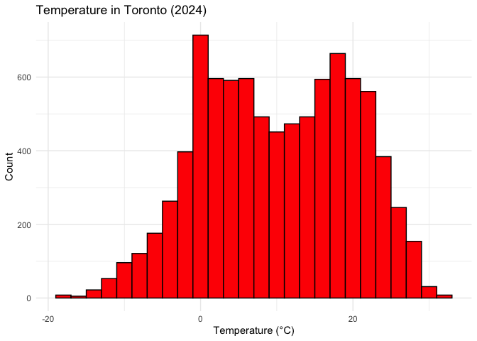
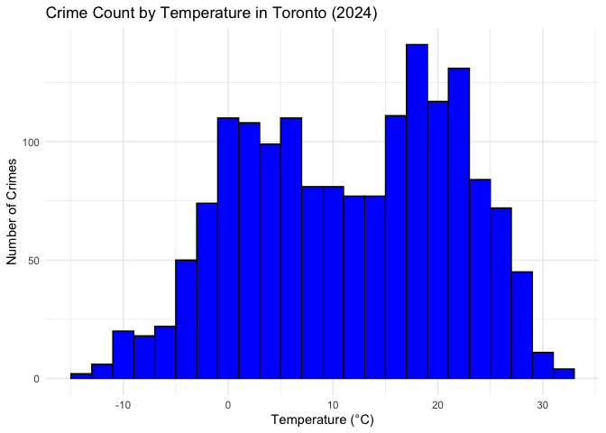
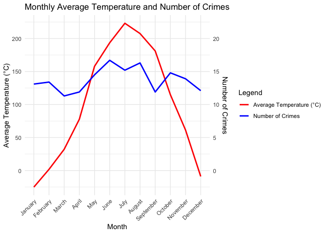
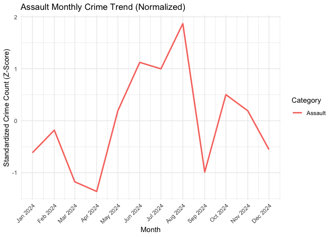
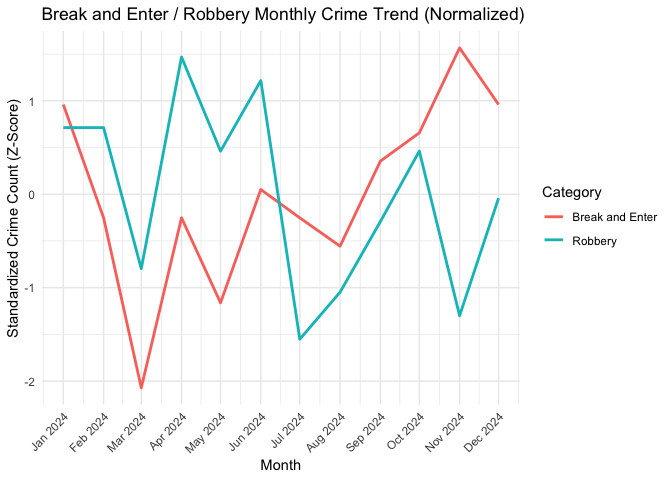
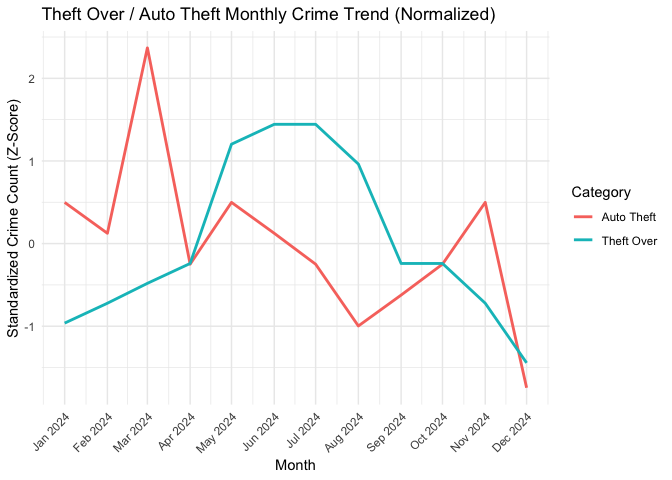

Weather and Crime in Toronto: Analyzing the Impact of Meteorological
Conditions on Criminal Activity
================
Richard Guo
2025-03-14

# Introduction

Understanding the factors that influence crime rates is a critical area
of study in criminology, urban planning, and public policy. Among the
various potential influences, weather conditions have been hypothesized
to play a role in influencing crime rates. Certain environmental
factors—such as temperature, precipitation, and visibility—may influence
human behavior, affecting both criminal activity and law enforcement
response times. For example, warmer temperatures might lead to an
increase in violent crimes due to heightened social interactions, while
heavy rainfall or snowfall could deter outdoor criminal activities. This
project aims to explore the relationship between outdoor weather
conditions and crime rates in Toronto (specifically Downtown Yonge East
and the Bay-Yonge Corridor) by integrating historical crime data with
meteorological records.

### Data

To conduct this analysis, I will use two primary datasets:

- Toronto Police Service’s Major Crime Indicators Dataset – The Toronto
  Police Service (TPS) provides publicly accessible crime data through
  its open data portal. The Major Crime Indicators dataset includes
  records of reported criminal incidents across the city, categorized
  into key crime types such as assault, robbery, and theft. Each entry
  contains information on the type of crime, the date and time it was
  reported, and the geographic location (latitude and longitude). This
  dataset is sourced from official police reports, making it a highly
  reliable indicator of crime trends. However, some limitations exist:
  crime reports may be influenced by reporting biases, police resource
  allocation, and differences in how crimes are classified over time.
  Each API call is also restricted to 2000 entries, meaning multiple API
  calls may be required. Additionally, minor crimes or unreported
  incidents are not captured, meaning the dataset represents a subset of
  all criminal activity in the city.

- Open-Meteo Historical Weather Data – The second dataset is obtained
  from Open-Meteo’s historical weather API. This dataset provides
  high-resolution hourly weather measurements for Toronto, including
  temperature, humidity, precipitation, snowfall, wind speed, and
  visibility. The data is derived from a combination of meteorological
  stations, satellite observations, and numerical weather prediction
  models, ensuring accuracy and consistency across different time
  periods. The Open-Meteo API aggregates data from multiple sources,
  including Environment Canada and global meteorological networks,
  making it a reliable source for historical climate conditions.
  However, it is important to note that some weather variables—such as
  localized precipitation or sudden wind gusts—may not always be
  captured with perfect precision, especially in highly variable urban
  microclimates.

By merging these two datasets using the date and hour as the common key,
I will explore how different weather conditions correspond to changes in
crime patterns. This study will employ statistical analysis and data
visualization techniques to identify potential correlations and trends.
The findings may provide valuable insights into the extent to which
environmental conditions influence criminal activity, contributing to a
broader understanding of crime dynamics in urban settings. These
insights could be of interest to law enforcement agencies, policymakers,
and urban planners aiming to improve public safety through data-driven
decision-making.

# Methods

### Data Collection

The datasets used in this analysis were collected from two publicly
available sources:

1.  Toronto Police Service’s Major Crime Indicators Dataset: This
    dataset was accessed through the Toronto Police Service Open Data
    API. It provides detailed information on reported crimes, including
    the type of crime, date and time of occurrence, and geographical
    location. The data was retrieved in JSON format and converted into
    an R data frame.

2.  Open-Meteo Historical Weather Data: The weather data was obtained
    from the Open-Meteo API, which provides high-resolution hourly
    historical weather measurements. The dataset includes temperature,
    humidity, wind speed, precipitation, and other meteorological
    variables for Toronto in 2024. The data was also retrieved in JSON
    format and converted into a structured data frame for analysis.

### Data Preprocessing

Before merging the datasets, several preprocessing steps were performed
to clean and format the data.

For the crime dataset:

- The Toronto Police Service Open Data API only allows for queries that
  return a maximum of 2000 rows. In order to capture a full year’s worth
  of data, the API was called twice; once with neighborhood Downtown
  Yonge East, and once with Bay-Yonge Corridor. The two resulting
  dataframes were then binded together.
- The OCC_MONTH field was originally stored as a month name and was
  converted into its corresponding numeric value.
- A new date variable was created by combining year, month, day, and
  hour into a single datetime format.

For the weather dataset:

- The weather data was structured into a cleaned dataframe containing
  only relevant meteorological variables.
- The datetime column, representing the timestamp of each weather
  record, was formatted as a POSIXct datetime object for consistency.

### Data Cleaning and Wrangling

After collecting the crime and weather datasets, several preprocessing
steps were necessary to ensure data integrity and prepare the data for
analysis. The cleaning and wrangling process involved handling missing
values, standardizing variable formats, and filtering unnecessary data.

#### Handling Missing Values

Missing data can impact analysis, so it was important to identify and
address any missing values in both datasets. The summary() function was
used to check for NA values, and missing values were handled by either
removing incomplete records or imputing reasonable estimates when
appropriate.

If missing values were found in key variables (e.g., date, crime type,
temperature), they were removed to avoid data inconsistencies:

For weather-related variables, missing values were imputed using median
values, which assumes that weather patterns remain relatively consistent
during short time frames.

#### Standardizing and Formatting Variables

The crime dataset contained categorical fields such as crime type and
location, while the weather dataset included numerical meteorological
variables. To ensure consistency, categorical variables were converted
to factors, and date-time formats were standardized using lubridate.

#### Filtering and Selecting Relevant Variables

To streamline analysis, unnecessary variables (e.g., unique IDs,
administrative fields) were removed. Only essential variables related to
crime occurrence and weather conditions were retained.

### Data Merging

The two datasets were merged using the datetime variable as the common
key. An inner join was performed to retain only records that had
matching timestamps in both datasets. Before the join, the crime dataset
had 1651 observations, and the meteorological data had 8784. After the
merge, the combined dataset retains 1651 entries, meaning no data was
lost during the merge.

## Preliminary Results

We start by taking a look at the number of crimes and average
temperature by month, as well as the distributions of temperatures and
crime.

| Month     | Average Temperature (°C) | Number of Crimes |
|:----------|-------------------------:|-----------------:|
| January   |                    -2.51 |              131 |
| February  |                     0.18 |              134 |
| March     |                     3.22 |              113 |
| April     |                     7.78 |              119 |
| May       |                    15.79 |              145 |
| June      |                    19.35 |              167 |
| July      |                    22.31 |              152 |
| August    |                    20.75 |              163 |
| September |                    18.11 |              119 |
| October   |                    11.49 |              148 |
| November  |                     6.13 |              139 |
| December  |                    -0.89 |              121 |

It appears that more crimes are committed during higher temperatures.
However, it is impossible to deduce any functional relationship between
temperature and crime count at this stage, as we have not considered any
other factors. For example, it may be easier to commit certain types of
offences, such as assault, during warmer seasons, as there are likely
more people outside and a lack of snow makes maneuverability
significantly easier. It can be difficult to visualize the relationship
between temperature and crime from these plots, so we can plot both on
separate axis’ to more closely examine the relationship.

While it does seem as though the number of crimes climbs between the
months of April and August, there is an unexpected drop in crimes during
September, even though October is when the temperature takes a steep
dive. We can also begin to examine the types of crime committed and how
they change with the temperature.

| Crime Category  | Number of Crimes |
|:----------------|-----------------:|
| Assault         |             1139 |
| Break and Enter |              178 |
| Robbery         |              170 |
| Theft Over      |               84 |
| Auto Theft      |               80 |

After splitting the categories into 3 distinct sections, based on the
number of crimes in each category, their standardized counts, which
represent the general trends over the months, were plotted. The
“Assault” and “Theft Over” categories show a distinct rise in the crimes
during the warmer months, while “Auto Theft” crimes actually dip in the
warmer months and peak during the Spring. The other categories show no
clear trends and have very volatile counts, likely due to a lack of data
(working around the 2000 row limit set by the API).

### Summary

This study explores the hypothesized relationship between weather
conditions and crime rates in Toronto, specifically in the Downtown
Yonge East and Bay-Yonge Corridor areas. The analysis reveals some
initial patterns suggesting some level of correlation between higher
temperatures and an increase in certain types of crime, especially
during the warmer months. Assault and theft crimes, in particular,
appear to rise as temperatures increase, potentially due to more outdoor
social interactions and easier mobility. However, other crime types,
such as auto theft, follow a different seasonal pattern, peaking in
spring and dropping during the summer months, which implies further
investigation is required.

The results highlight the complexities of crime dynamics, where weather
conditions are just one factor among many that influence criminal
activity. There is also evidence of volatility in some crime categories,
possibly due to limitations in the available data. Despite these
challenges, the study provides important preliminary insights into how
environmental factors may shape crime patterns in urban areas,
contributing to the broader criminological understanding of crime
dynamics.

#### Plan for Further Analysis

While the initial findings indicate a potential relationship between
weather and crime, further analysis is needed to draw more robust
conclusions. The next steps could potentially include:

- Regression Analysis: A multiple regression model will be used to
  quantify the relationship between various weather variables (e.g.,
  temperature, precipitation, wind speed) and crime rates. This will
  help assess the strength of the relationship while controlling for
  other potential confounders such as time of day, day of the week, and
  neighborhood-specific factors. Interaction terms between weather
  conditions and other variables may also be tested to explore more
  complex relationships.

- Time Series Analysis: Given that crime and weather patterns vary over
  time, time series analysis can be applied to examine trends in the
  data. This analysis could help identify if the relationship between
  weather and crime is consistent over time or if it fluctuates in
  response to other factors.

- Crime Type Segmentation: Future analysis could dive deeper into
  specific crime categories by segmenting the data more effectively. For
  example, different weather conditions may have varying impacts on
  violent crimes versus property crimes, which could reveal more hidden
  trends.

- Data Augmentation and External Factors: To improve the model’s
  robustness, future analyses could incorporate external data sources,
  such as economic indicators (e.g., unemployment rates) or social
  factors (e.g., major events), which may further explain fluctuations
  in crime rates. There is also the possibility of further enhancing the
  crime dataset by making even more API calls to get around the 2000
  observation limit.

By employing these methods, future research could provide a clearer and
more comprehensive understanding of how weather affects crime, offering
valuable insights for law enforcement, policymakers, and urban planners.
These findings could inform strategies to decrease crime in response to
environmental factors, enhancing public safety during different weather
conditions.
